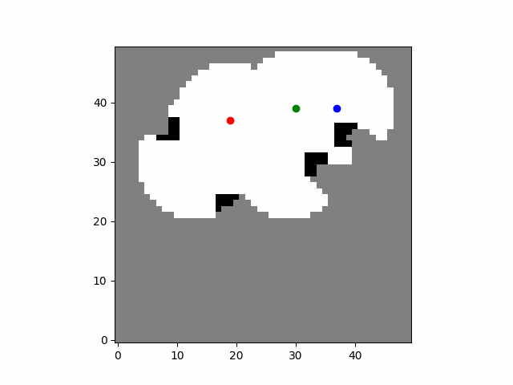
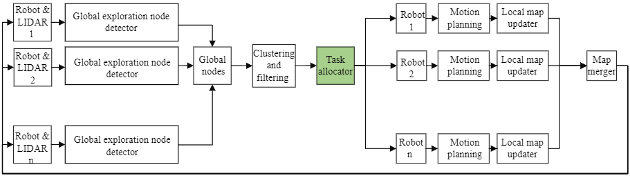
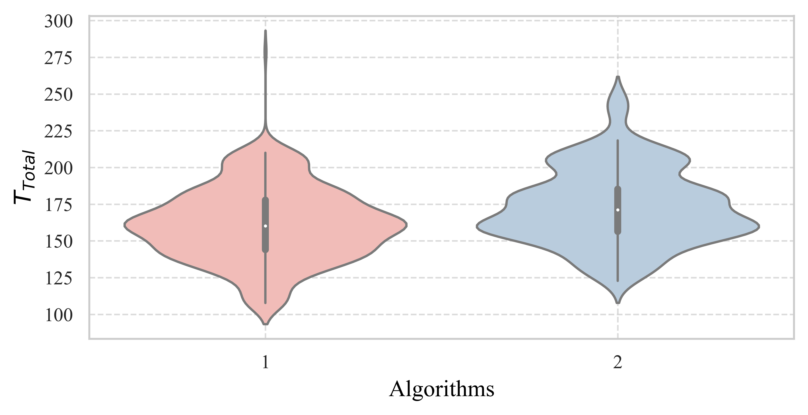
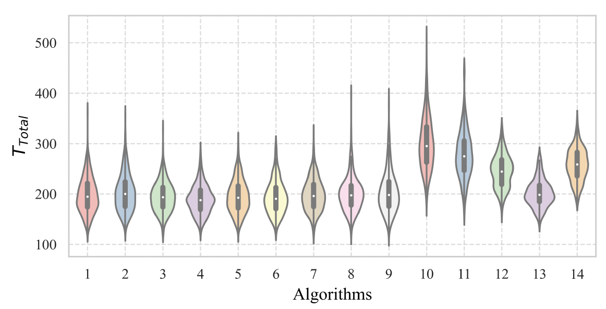
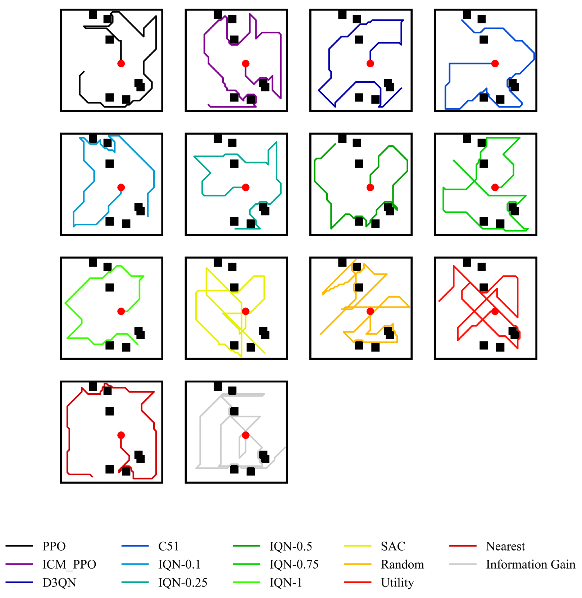

# Autonomous Exploration of Unknown Indoor Environments 
This repository contains codes for novel intelligent and classical autonomous exploration policies, applicable to both single and multi-robot scenarios, along with a developed 2D simulation environment. The current version of the simulation environment includes modules for Exploration, Mapping, and Motion Planning, with the main focus on the Exploration module. 

# Citing
Please cite our paper if you find this repository useful. You can find our open source paper here:
https://rdcu.be/evJLn 

@article{IDCL2025JIRS,
  title={Risk-Sensitive Autonomous Exploration of Unknown Environments: A Deep Reinforcement Learning Perspective},
  author={Sarfi, Mohammad Hossein and Bisheban, Mahdis},
  journal={Journal of Intelligent \& Robotic Systems},
  volume={111},
  number={1},
  pages={36},
  year={2025},
  publisher={Springer}
}

# System Architecture 
The general system architecture used for autonomous exploration and mapping in this repository is depicted in the following figure. The developed autonomous exploration policies, whether for single or multi-robot scenarios, are applied to the robot(s) through the task allocation module.

# Classical Collaborative Multi-Robot Autonomous Exploration Policies
This repository introduces a novel coordinated autonomous exploration strategy inspired by Market-Based task allocation and Ant Colony Optimization techniques. This method integrates pheromone optimization into the utility function of the market-based task allocation module, reducing overlap between robots and improving efficiency.

The violin plot below compares the time required to explore more than 95% of the map for three algorithms:

1. Market-based task allocation enhanced with pheromone optimization
2. Simple Market-based task allocation

Comparing the average of exploratoin times shows that the proposed method reduces exploration time. This experiment is conducted on 500 different maps with three robots. Three mentioned algorithms are compared on the same map with the same starting position for all robots to have a fair comparison. 

# Intelligent single-Robot Autonomous Exploration Policies
This repository develops intelligent single-robot autonomous techniques using advanced Deep Reinforcement Learning (DRL) algorithms. The following algorithms are trained and evaluated on both test and training maps:

1. PPO
2. PPO-ICM
3. Dueling Double DQN
4. C51
5. IQN (with various CVaR values)
6. SAC

The following violin plot demonstrates that nearly all intelligent policies explored the same unknown environment more quickly compared to classical methods (including different variants of IQN). 

The following Figure shows the exploration path generated using different policies for the same sample test map and starting
point. More detailed technical information can be found in our paper.

# To do 
- DRL-based multi robot autonomous exploration 
- Robots dynamics 
- Local motion planner 
- Localization (Particle filter,Kalman filter)
- Mapping (shift back to bayesian update)
# References
Some of the current codes are inspired or developed by the following repositories: 
- https://github.com/marload/DeepRL-TensorFlow2/tree/master
- https://github.com/marload/DistRL-TensorFlow2
- https://github.com/tsmatz/reinforcement-learning-tutorials/blob/master/06-sac.ipynb
- https://github.com/BY571/IQN-and-Extensions

